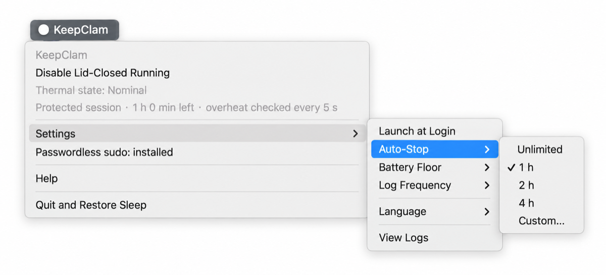

<div align="center">

# 🦪 KeepClam

### Keep calm. Keep the lid closed. Keep running.

A tiny macOS menu-bar app that keeps your MacBook running with the lid closed — on battery, with no external display.<br>
Built for coding agents that keep working after you close the lid (Claude Code, Codex, …), overnight builds, big downloads and data syncs.

[](https://github.com/LCROSSY/KeepClam/releases)
[](#installation)
[](https://github.com/LCROSSY/KeepClam/actions/workflows/ci.yml)
[](LICENSE)

**English** | [简体中文](README.zh-CN.md)

**[Quick Start](#quick-start) · [Features](#features) · [Comparison](#comparison) · [Installation](#installation) · [FAQ](#faq) · [Uninstall](#uninstall)**

</div>

## The menu

<p align="center"></p>

The menu-bar title shows the current state: `○ KeepClam` when off, `● KeepClam` while running lid-closed.

## Quick Start

1. **Install**: run this in Terminal. No Xcode or Homebrew needed; the script verifies the release, then installs and opens the app.

   ```sh
   curl -fsSL https://raw.githubusercontent.com/LCROSSY/KeepClam/main/scripts/install.sh | bash
   ```

2. **Install passwordless sudo** (one time): choose **Passwordless sudo: not installed — click to install** in the menu and enter your admin password once. Unattended auto-stops and overheat protection rely on it; see [Passwordless sudo](#passwordless-sudo).
3. **Turn it on**: choose **Enable Lid-Closed Running**. Once the menu bar shows `● KeepClam`, close the lid and your work keeps running.

## Why KeepClam?

`caffeinate` and power-assertion apps (such as KeepingYouAwake) only prevent *idle* sleep. Without an external display, closing the lid still puts the Mac to sleep. In user space, the only switch that holds off lid-close sleep is the kernel's `SleepDisabled` flag (`sudo pmset -a disablesleep 1`).

Flipping that switch by hand is risky: nothing watches the temperature, and if a script fails or you forget to turn it off, the Mac stays awake until the battery runs out. KeepClam puts a safety net around that switch.

## Features

- 🌡️ **Overheat protection**: an independent guard process reads macOS's thermal pressure every 5 seconds. At **Serious** or **Critical**, or after 3 failed reads in a row, it logs the event, restores sleep and puts the Mac to sleep immediately.
- 🛟 **Crash safety**: the guard runs separately from the app. If the app quits or crashes, the guard restores sleep right away; if the guard disappears, the app notices within 5 seconds and restores sleep itself.
- 🔋 **Auto-stop**: stop after a set time (1 / 2 / 4 hours, or custom 1 minute–24 hours) or at a battery floor (20% by default, adjustable 5%–95%); Low Power Mode or repeated battery read failures also stop it. Battery checks apply only when running on battery. Stopping with the lid closed puts the Mac to sleep immediately.
- 🔒 **Narrow passwordless sudo**: one sudoers rule that allows exactly two fixed `pmset` commands, so toggling doesn't ask for a password every time.
- 👁️ **Honest status**: every menu-bar refresh re-reads the real state from the kernel, and clearly labels a state that was turned on by something else.
- 📜 **Session logs**: records lid and thermal state at your chosen frequency (network reachability is probed at most once a minute) and merges repeated states into one line, so you can see what happened overnight.
- 🌐 **English and Chinese**: switch in **Settings → Language**; takes effect immediately.

With the lid closed and no external display, macOS turns off the built-in display on its own, so no power is wasted on it.

## Comparison

| | `caffeinate` and power-assertion apps | Manual `pmset disablesleep 1` | **KeepClam** |
| :--- | :---: | :---: | :---: |
| Keeps running lid-closed without an external display | ❌ | ✅ | ✅ |
| Stops automatically when overheating | — | ❌ | ✅ |
| Restores sleep if the app quits or crashes | — | ❌ manual restore | ✅ |
| Auto-stops by time or battery level | Some apps | ❌ | ✅ |
| Puts a closed Mac to sleep when stopping | — | ❌ | ✅ |
| No password prompt on every toggle | No root needed | ❌ `sudo` each time | ✅ narrow sudoers rule |

## Installation

**Requirements:** macOS 13 or later. Universal binary, tested on Apple Silicon; the Intel slice is included but untested on real hardware.

Current releases are ad-hoc signed and **not notarized by Apple**.

### Option 1: One command (recommended)

```sh
curl -fsSL https://raw.githubusercontent.com/LCROSSY/KeepClam/main/scripts/install.sh | bash
```

- Picks the newest release (including previews) and verifies the SHA-256 checksum, archive contents, app identity and code signature. If any check fails, the installed app is left untouched.
- Shows the version, source and install location, then asks you to press Enter. Installs to `/Applications`, or `~/Applications` if that isn't writable; an existing install is updated in place, so you never end up with two copies.
- Apps installed this way carry no quarantine attribute, so macOS won't block the first launch.
- To update, run the same command again. A running app is quit first and reopened afterwards; if a lid-closed session is active, the script stops and asks you to turn it off from the menu first.

### Option 2: Homebrew

```sh
brew install --cask LCROSSY/tap/keepclam
```

To update: `brew update && brew upgrade --cask keepclam`. macOS may block the first launch of a Homebrew install; see the [FAQ](#faq).

<details>
<summary><b>Installer options</b></summary>

Add options after `bash -s --`, for example to pick a version, install to your personal Applications folder and skip launching:

```sh
curl -fsSL https://raw.githubusercontent.com/LCROSSY/KeepClam/main/scripts/install.sh | bash -s -- --version 0.2.1 --app-dir "$HOME/Applications" --no-open
```

- `--yes`: confirm without asking (for non-interactive use).
- `--language zh|en`: output language; follows your system by default.
- All options: `bash install.sh --help`.

The script stops and explains why if a lid-closed session is active, the legacy LidAwake app is running, or KeepClam was installed with Homebrew.
</details>

<details>
<summary><b>Offline install (downloaded release files)</b></summary>

Download `install.sh`, `KeepClam-<version>.zip` and `SHA256SUMS` from [Releases](https://github.com/LCROSSY/KeepClam/releases) into one folder and run there:

```sh
shasum -a 256 -c SHA256SUMS && bash install.sh --local .
```

Browser downloads carry a quarantine attribute, so the script asks you to choose: enter **1** to install and trust KeepClam (removes only this app's quarantine attribute), **2** to install only, or press Enter to cancel.
</details>

<details>
<summary><b>Manual install</b></summary>

Download `KeepClam-<version>.zip` and `SHA256SUMS`, verify with `shasum -a 256 -c --ignore-missing SHA256SUMS`, then double-click the ZIP in Finder and drag **KeepClam.app** to Applications. If the first launch is blocked, see the [FAQ](#faq).
</details>

<details>
<summary><b>Build from source</b></summary>

Requires Xcode Command Line Tools (run `xcode-select --install` if you don't have them):

```sh
git clone https://github.com/LCROSSY/KeepClam.git
cd KeepClam
zsh scripts/build-native.command
open build/KeepClam.app
```
</details>

## Passwordless sudo

Toggling `SleepDisabled` needs admin rights. KeepClam offers a one-time sudoers rule that allows only these two commands, with no wildcards:

```text
<your-username> ALL=(root) NOPASSWD: /usr/bin/pmset -a disablesleep 0, /usr/bin/pmset -a disablesleep 1
```

- **Install**: choose **Passwordless sudo: not installed — click to install** in the menu, or run `zsh scripts/install-sudoers.sh` in the repository.
- **Inspect**: `sudo cat /etc/sudoers.d/keepclam`
- **Remove**: `sudo rm -f /etc/sudoers.d/keepclam` (or `zsh scripts/uninstall-sudoers.sh` in the repository).

KeepClam works without it, but asks for your password on every toggle. **Install it before leaving the Mac unattended**: the guard and auto-stop use the passwordless path (`sudo -n`), and nobody is there to type a password.

## Launch at Login

Turn on **Settings → Launch at Login** (off by default). It only starts the menu-bar app at login; it never enables lid-closed running or resumes a previous session. If macOS requires approval, the menu opens the Login Items settings.

## Safety and emergency restore

- **Use at your own risk.** `disablesleep` is a global power setting that macOS doesn't expose in System Settings; re-test after major macOS upgrades.
- **Don't put a running closed MacBook in a bag** or anywhere without airflow. The thermal guard reads macOS's thermal pressure levels, not Celsius; it is a best-effort safety net, not a substitute for ventilation.
- If anything goes wrong, this restores the default sleep behavior immediately:

```sh
sudo pmset -a disablesleep 0     # restore default sleep
pmset -g | grep SleepDisabled    # verify: "SleepDisabled 1" should be gone
```

## FAQ

<details>
<summary><b>macOS blocks the first launch. What should I do?</b></summary>

Installs from the one-line command aren't affected. Homebrew and manual installs carry a quarantine attribute, and KeepClam isn't notarized, so macOS may block it. If you trust the source, try opening it once, then go to **System Settings → Privacy & Security** and click **Open Anyway**. See [Apple's instructions](https://support.apple.com/en-us/102445).

Or remove only KeepClam's quarantine attribute in Terminal (use `"$HOME/Applications/KeepClam.app"` for a personal install):

```sh
xattr -dr com.apple.quarantine "/Applications/KeepClam.app"
```
</details>

<details>
<summary><b>Why thermal levels instead of Celsius?</b></summary>

Apple Silicon offers no stable, unified CPU temperature API to unprivileged apps. KeepClam reads `NSProcessInfo.thermalState` (Nominal / Fair / Serious / Critical), the same signal macOS uses to decide when to throttle.
</details>

<details>
<summary><b>What if the guard process dies?</b></summary>

The app notices within 5 seconds: it logs `guard_missing`, sends a notification and restores sleep itself; if that fails, it tells you to run the emergency command. The guard is an ordinary user process, so other programs running as you can kill it — a trade-off accepted for a personal tool.
</details>

<details>
<summary><b>If the app crashes, does auto-stop still work?</b></summary>

Yes. The timer, battery floor and Low Power Mode checks all run in the guard. When the app quits or crashes, the guard restores sleep within one check cycle — sooner than any timer would.
</details>

<details>
<summary><b>How do I see what happened while the lid was closed?</b></summary>

Logs are in `~/Library/Logs/KeepClam/`; open them from **Settings → View Logs**. Key events such as overheating, timer stops and low battery also send notifications you'll see when you open the lid.
</details>

## Uninstall

1. Choose **Disable Lid-Closed Running** in the menu and turn off **Settings → Launch at Login**.
2. Remove passwordless sudo: `sudo rm -f /etc/sudoers.d/keepclam`.
3. Choose **Quit and Restore Sleep**.
4. Delete the app: `brew uninstall --cask keepclam` for Homebrew installs; otherwise move **KeepClam.app** to the Trash.
5. (Optional) Delete logs in `~/Library/Logs/KeepClam/` and settings with `defaults delete io.github.LCROSSY.keepclam`.

Finally, run `pmset -g | grep SleepDisabled` and make sure `SleepDisabled 1` is not shown.

## Development

```sh
zsh scripts/build-native.command        # build the app
clang -fobjc-arc -framework Cocoa -framework IOKit -framework UserNotifications -framework ServiceManagement \
      Sources/LogTests.m -o build/LogTests && ./build/LogTests   # run tests
python3 scripts/test-install.py          # check installation and updates in temporary directories
```

Single-file Objective-C/AppKit, no Xcode project, no dependencies. See [Architecture](docs/architecture.md) for how the guard and brake path work.

## License

[MIT](LICENSE)
