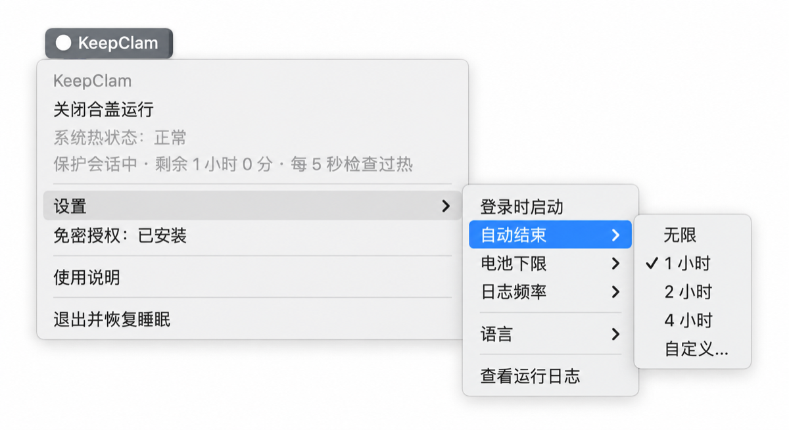

<div align="center">

# 🦪 KeepClam

### 盖子合上，任务继续跑

一个 macOS 菜单栏小工具：合上 MacBook 盖子后照常运行，不用外接显示器，用电池也行。<br>
适合合盖后还要继续干活的编程智能体（Claude Code、Codex 等）、过夜编译、大文件下载和数据同步。

[](https://github.com/LCROSSY/KeepClam/releases)
[](#安装)
[](https://github.com/LCROSSY/KeepClam/actions/workflows/ci.yml)
[](LICENSE)

[English](README.md) | **简体中文**

**[快速开始](#快速开始) · [功能](#功能) · [同类工具对比](#同类工具对比) · [安装](#安装) · [常见问题](#常见问题) · [卸载](#卸载)**

</div>

## 菜单栏一览

<p align="center"></p>

菜单栏标题显示当前状态：`○ KeepClam` 未开启，`● KeepClam` 合盖运行中。

## 快速开始

1. **安装**：在「终端」中运行下面这条命令。不需要 Xcode 或 Homebrew，脚本会校验安装包后再安装并打开应用。

   ```sh
   curl -fsSL https://raw.githubusercontent.com/LCROSSY/KeepClam/main/scripts/install.sh | bash
   ```

2. **安装免密授权**（一次性）：在菜单中点击「免密授权：未安装 — 点击安装」，输入一次管理员密码。合盖后无人值守时，自动结束和过热保护都靠它完成，详见[免密授权](#免密授权)。
3. **开启**：点击「开启合盖运行」，菜单栏变成 `● KeepClam` 后合上盖子，任务继续跑。

## 为什么需要它

`caffeinate` 和电源断言类工具（如 KeepingYouAwake）只能阻止 Mac 因闲置而睡眠。没接外接显示器时，一合盖 Mac 还是会睡。在用户态，能挡住合盖睡眠的只有内核的 `SleepDisabled` 开关（`sudo pmset -a disablesleep 1`）。

直接打开这个开关有风险：发热时没人管，脚本出错或忘了关，Mac 会一直保持不睡，直到电池耗尽。KeepClam 做的事，就是给这个开关配上一套安全网。

## 功能

- 🌡️ **过热保护**：独立的守护进程每 5 秒读取一次 macOS 的热压力等级。达到「过高」或「严重过热」，或者连续 3 次读不到时，记下日志、恢复睡眠并让 Mac 立即休眠。
- 🛟 **崩溃兜底**：守护进程独立于应用运行。应用退出或崩溃，守护进程会马上恢复睡眠；守护进程不见了，应用也会在 5 秒内发现并自行恢复。
- 🔋 **自动结束**：可以按时长（1 / 2 / 4 小时，或自定义 1 分钟–24 小时）和电池下限（默认 20%，可调 5%–95%）自动结束，进入低电量模式或连续读不到电量也会结束，这几项电量判断只在用电池时生效。合盖状态下结束时会立即休眠。
- 🔒 **窄范围免密授权**：一条只放行两条固定 `pmset` 命令的 sudoers 规则，开关时不用每次输密码。
- 👁️ **状态真实**：菜单栏每次刷新都从内核重新读取实际状态；如果开关是被其他途径打开的，会明确标出来。
- 📜 **会话日志**：按设定的频率记录盖子开合和热状态（网络连通性最多每分钟检测一次），相同状态合并成一条，方便回看「昨晚合盖期间发生了什么」。
- 🌐 **中英双语**：在「设置 → 语言」中切换，即时生效。

合盖且没接外接显示器时，macOS 会自行关闭内屏，不会额外耗电。

## 同类工具对比

| | `caffeinate` 等电源断言工具 | 手动 `pmset disablesleep 1` | **KeepClam** |
| :--- | :---: | :---: | :---: |
| 合盖、无外接显示器时保持运行 | ❌ | ✅ | ✅ |
| 过热时自动结束 | — | ❌ | ✅ |
| 程序退出或崩溃后恢复睡眠 | — | ❌ 需手动恢复 | ✅ |
| 按时长、电量自动结束 | 部分工具支持 | ❌ | ✅ |
| 结束时让合盖的 Mac 立即睡下 | — | ❌ | ✅ |
| 开关时无需每次输密码 | 无需 root | ❌ 每次 `sudo` | ✅ 窄范围 sudoers 规则 |

## 安装

**系统要求**：macOS 13 及以上。安装包是通用二进制，已在 Apple Silicon 上实测；Intel 版随包附带，但没在真机上测过。

当前版本使用临时签名（ad-hoc），**未经过 Apple 公证**。

### 方式一：一行命令（推荐）

```sh
curl -fsSL https://raw.githubusercontent.com/LCROSSY/KeepClam/main/scripts/install.sh | bash
```

- 自动选择最新发布版（包含预览版），校验 SHA-256、压缩包内容、应用身份和代码签名，任一项不通过都不会替换已安装的应用。
- 显示版本、来源和安装位置后，按回车确认。默认装到「应用程序」，不可写时改用 `~/Applications`。
- 用这种方式安装的应用不带下载隔离标记，首次打开不会被 macOS 拦截。
- 更新：先在菜单中结束合盖运行并退出应用，再运行同一条命令。

### 方式二：Homebrew

```sh
brew install --cask LCROSSY/tap/keepclam
```

更新：`brew update && brew upgrade --cask keepclam`。Homebrew 安装的应用首次打开可能被 macOS 拦截，处理方法见[常见问题](#常见问题)。

<details>
<summary><b>安装脚本的选项</b></summary>

在 `bash -s --` 后面加选项，例如指定版本、装到个人应用目录、装完不打开：

```sh
curl -fsSL https://raw.githubusercontent.com/LCROSSY/KeepClam/main/scripts/install.sh | bash -s -- --version 0.2.1 --app-dir "$HOME/Applications" --no-open
```

- `--yes`：不询问，直接确认（适合非交互环境）。
- `--language zh|en`：指定输出语言，默认跟随系统。
- 全部选项：`bash install.sh --help`。

如果 KeepClam 正在运行，或者是通过 Homebrew 安装的，脚本会停止并说明原因。
</details>

<details>
<summary><b>离线安装（已下载发布文件）</b></summary>

从 [发布页](https://github.com/LCROSSY/KeepClam/releases) 下载 `install.sh`、`KeepClam-<版本号>.zip` 和 `SHA256SUMS`，放在同一目录，在该目录运行：

```sh
shasum -a 256 -c SHA256SUMS && bash install.sh --local .
```

浏览器下载的文件带有下载隔离标记，所以脚本会让你选择：输入 **1** 安装并信任 KeepClam（只移除这个应用的隔离标记），输入 **2** 仅安装，直接回车取消。
</details>

<details>
<summary><b>手动安装</b></summary>

下载 `KeepClam-<版本号>.zip` 和 `SHA256SUMS`，运行 `shasum -a 256 -c --ignore-missing SHA256SUMS` 校验，然后在「访达」中双击解压，把 **KeepClam.app** 拖进「应用程序」。首次打开如果被拦截，见[常见问题](#常见问题)。
</details>

<details>
<summary><b>从源码构建</b></summary>

需要 Xcode Command Line Tools（没有的话先运行 `xcode-select --install`）：

```sh
git clone https://github.com/LCROSSY/KeepClam.git
cd KeepClam
zsh scripts/build-native.command
open build/KeepClam.app
```
</details>

## 免密授权

切换 `SleepDisabled` 需要管理员权限。KeepClam 提供一条一次性的 sudoers 规则，只放行下面两条命令，没有通配符：

```text
<你的用户名> ALL=(root) NOPASSWD: /usr/bin/pmset -a disablesleep 0, /usr/bin/pmset -a disablesleep 1
```

- **安装**：在菜单中点击「免密授权：未安装 — 点击安装」，或在仓库目录运行 `zsh scripts/install-sudoers.sh`。
- **查看**：`sudo cat /etc/sudoers.d/keepclam`
- **移除**：`sudo rm -f /etc/sudoers.d/keepclam`（或在仓库目录运行 `zsh scripts/uninstall-sudoers.sh`）。

不装也能用，只是每次开关都会弹出密码框。但**合盖无人值守前务必装好**：守护进程和自动结束用的是免密通道（`sudo -n`），人不在时没法输密码。

## 登录时启动

在「设置 → 登录时启动」中开启，默认关闭。它只会在登录时启动菜单栏应用，不会自动开启合盖运行，也不会恢复上次的会话。如果需要系统批准，点击该选项会打开系统的登录项设置。

## 安全须知与应急恢复

- **请自担风险。** `disablesleep` 是 macOS 没有在系统设置里公开的全局电源参数，macOS 大版本升级后请重新验证。
- **不要把合盖运行的 MacBook 放进包里**或其他不通风的地方。过热保护读取的是系统的热压力等级，不是摄氏温度，只能尽力兜底，代替不了通风散热。
- 万一出问题，下面这条命令可以立即恢复系统默认的睡眠行为：

```sh
sudo pmset -a disablesleep 0     # 恢复默认睡眠
pmset -g | grep SleepDisabled    # 确认：不应再出现 "SleepDisabled 1"
```

## 常见问题

<details>
<summary><b>首次打开被 macOS 拦截怎么办？</b></summary>

用一行命令安装的不会遇到这个问题。通过 Homebrew 或手动安装时，应用带有下载隔离标记，而 KeepClam 未经 Apple 公证，所以可能被拦截。确认来源可信后，先尝试打开一次，再到「系统设置 → 隐私与安全性」点击「仍要打开」，参见 [Apple 官方说明](https://support.apple.com/zh-cn/102445)。

也可以在终端只移除 KeepClam 的隔离标记（装在个人应用目录时，把路径换成 `"$HOME/Applications/KeepClam.app"`）：

```sh
xattr -dr com.apple.quarantine "/Applications/KeepClam.app"
```
</details>

<details>
<summary><b>为什么显示热等级，而不是摄氏温度？</b></summary>

Apple Silicon 没有向普通权限的程序提供稳定统一的 CPU 温度接口。KeepClam 读取的是 `NSProcessInfo.thermalState`（正常 / 略高 / 过高 / 严重过热），macOS 自己决定是否降频时看的也是这个信号。
</details>

<details>
<summary><b>守护进程自己挂了怎么办？</b></summary>

应用最多 5 秒就会发现：记一条 `guard_missing` 日志、发通知，然后自己恢复睡眠；恢复失败时会通知你手动执行应急命令。守护进程是普通用户进程，同一用户的其他程序可以结束它，这是个人工具接受的取舍。
</details>

<details>
<summary><b>应用崩溃了，自动结束还有效吗？</b></summary>

有效。定时、电池下限和低电量模式的判断都在守护进程里完成。应用一退出或崩溃，守护进程在一个检查周期内就会恢复睡眠，比等定时器到期更早。
</details>

<details>
<summary><b>怎么知道合盖期间发生了什么？</b></summary>

日志在 `~/Library/Logs/KeepClam/`，也可以从「设置 → 查看运行日志」打开。过热、定时结束、电量不足等关键事件还会发系统通知，开盖后就能看到。
</details>

## 卸载

1. 在菜单中点击「关闭合盖运行」，并关闭「设置 → 登录时启动」。
2. 移除免密授权：`sudo rm -f /etc/sudoers.d/keepclam`。
3. 点击「退出并恢复睡眠」。
4. 删除应用：Homebrew 安装的运行 `brew uninstall --cask keepclam`，其他方式安装的把 **KeepClam.app** 移到废纸篓。
5. （可选）删除日志 `~/Library/Logs/KeepClam/` 和设置 `defaults delete io.github.LCROSSY.keepclam`。

最后运行 `pmset -g | grep SleepDisabled` 确认没有输出 `SleepDisabled 1`。

## 开发

```sh
zsh scripts/build-native.command        # 构建应用
clang -fobjc-arc -framework Cocoa -framework IOKit -framework UserNotifications -framework ServiceManagement \
      Sources/LogTests.m -o build/LogTests && ./build/LogTests   # 运行测试
python3 scripts/test-install.py          # 在临时目录中验证安装与更新
```

整个应用就一个 Objective-C/AppKit 源文件，没有 Xcode 工程，零依赖。守护进程、刹车路径等设计见 [架构说明](docs/architecture.zh-CN.md)。

## 许可

[MIT](LICENSE)
