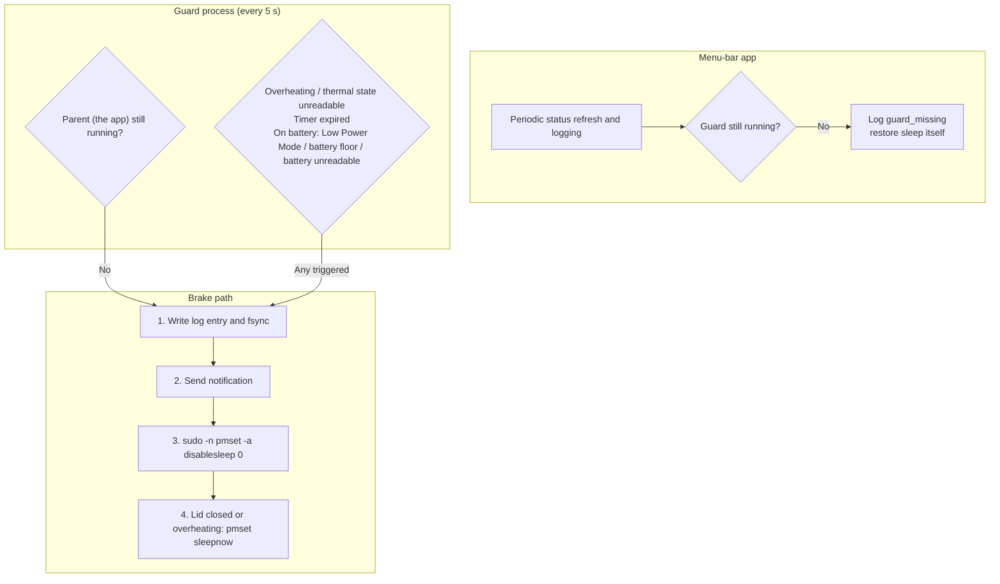

# Architecture

**English** | [简体中文](architecture.zh-CN.md)

KeepClam runs as two processes: the menu-bar app, and a guard process the app starts when lid-closed running is enabled. Both run as the current user; there is no resident root process. Admin rights are needed only for the two `pmset` commands that toggle `SleepDisabled`, which go through [passwordless sudo](../README.md#passwordless-sudo).

## Guard process

- When lid-closed running is enabled, the app launches its own executable with `--guard` and waits for a pipe handshake confirming the guard is ready. If the thermal state is already Serious or worse, or `SleepDisabled` did not take effect, the guard exits and enabling fails.
- The guard writes its PID and start time (seconds plus microseconds) to `~/Library/Application Support/KeepClam/guard.lock` and holds an exclusive lock on it. When stopping it, the app checks the PID, start time and user, so it never signals an unrelated process that reused the PID.
- Each cycle checks, in order: whether the parent is alive, the thermal state, the timer, and — on battery — Low Power Mode, the battery floor and battery reads. Any match enters the brake path. Settings live in the app's preferences and are re-read every cycle, so changing the timer or battery floor mid-session takes effect immediately.

## Brake path

Every stop condition shares one path, in a fixed order:

1. **Evidence first**: write a `PROTECTION_TRIGGER` log entry and `fsync` it, so the record is on disk even if sleep follows immediately.
2. **Notify**: send a notification before sleep can take effect.
3. **Restore sleep**: run `pmset -a disablesleep 0` through the passwordless path; log and notify on failure.
4. **Request sleep**: run `pmset sleepnow` when the lid is closed or on overheating. Clearing `SleepDisabled` alone doesn't put a closed Mac to sleep — the system only falls back to idle sleep, which a running task usually blocks — so sleep must be requested explicitly.

The guard reports a planned brake through its exit code (10 plus the reason index), so the app can tell a planned brake from a lost guard.

## App side

- Every menu-bar refresh re-reads the real `SleepDisabled` value from the kernel. If something else turned it on, the menu labels it as enabled externally and suggests turning it off and on again in KeepClam to get protection.
- If the guard disappears unexpectedly, the app logs `guard_missing`, sends a notification and restores sleep itself.
- Log writes happen on a background queue so disk I/O never stalls the menu; repeated states are merged into one line. Network reachability is probed at most once a minute.
- The app holds a single-instance lock and detects a running legacy LidAwake, so two programs never fight over the system sleep setting.

## Known trade-offs

- The guard is an ordinary user process, so other programs running as you can kill it. The app notices within 5 seconds and restores sleep, but if both the app and the guard are killed, only the [emergency restore](../README.md#safety-and-emergency-restore) command helps.
- Overheat detection uses macOS's thermal pressure levels, not Celsius.
