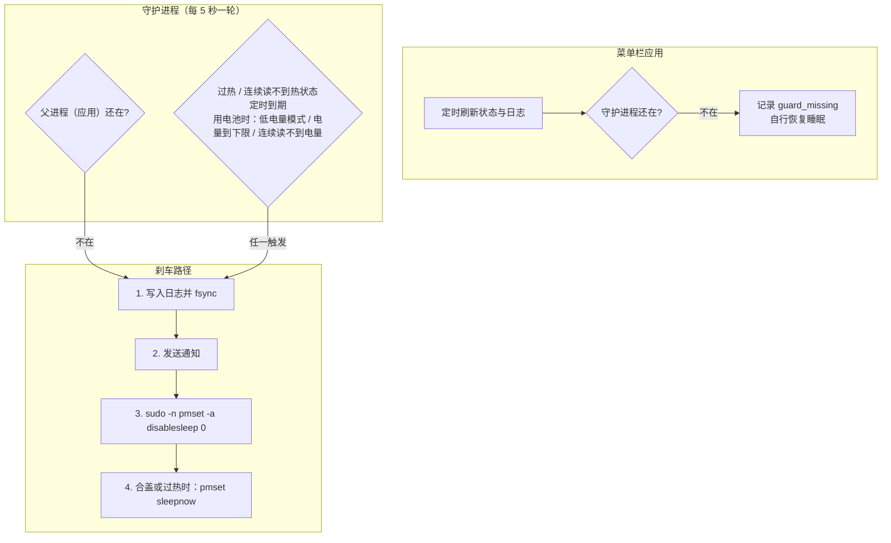

# 架构说明

[English](architecture.md) | **简体中文**

KeepClam 由两个进程组成：菜单栏应用，以及开启合盖运行时由应用启动的守护进程。两者都以当前用户身份运行，没有常驻的 root 进程；需要管理员权限的只有切换 `SleepDisabled` 的两条 `pmset` 命令，通过[免密授权](../README.zh-CN.md#免密授权)执行。

## 守护进程

- 开启合盖运行时，应用用 `--guard` 参数启动自身的可执行文件作为守护进程，并通过管道握手确认它已就绪。启动时如果热状态已经过高，或 `SleepDisabled` 没有生效，守护进程会直接退出，开启失败。
- 守护进程把自己的 PID 和启动时间（秒加微秒）写入 `~/Library/Application Support/KeepClam/guard.lock`，并持有这个文件的排他锁。停止时应用会核对 PID、启动时间和用户，避免误杀 PID 被复用后的其他进程。
- 每一轮依次检查：父进程是否还在、热状态、定时是否到期，以及用电池时的低电量模式、电量下限和电量读取。任一条件满足就进入刹车路径。设置保存在应用的偏好设置里，守护进程每轮重新读取，所以会话中修改定时或电池下限会立即生效。

## 刹车路径

所有结束条件共用一条路径，顺序是固定的：

1. **先留证据**：写入 `PROTECTION_TRIGGER` 日志并 `fsync`，确保后面即使马上休眠，记录也已落盘。
2. **通知**：在休眠生效前发出系统通知。
3. **恢复睡眠**：通过免密通道执行 `pmset -a disablesleep 0`，失败时记录日志并通知。
4. **请求休眠**：合盖时或过热时执行 `pmset sleepnow`。只清除 `SleepDisabled` 并不会让合上的 Mac 睡着，系统只会回到闲置睡眠，而正在运行的任务往往会阻止闲置睡眠，所以必须主动请求。

守护进程用退出码（10 加原因序号）告诉应用这是一次有计划的刹车，应用据此区分「正常刹车」和「守护进程丢失」。

## 应用这一侧

- 菜单栏每次刷新都从内核重新读取 `SleepDisabled` 的实际值。如果开关是被其他途径打开的，会标为「外部开启」，提示在菜单中关闭后重新开启以获得保护。
- 应用发现守护进程意外消失时，会记录 `guard_missing`、发出通知并自行恢复睡眠。
- 日志写入在后台队列中进行，不会卡住菜单；相同状态会合并成一条。网络连通性最多每分钟检测一次。
- 应用持有单实例锁，并会检测旧版 LidAwake 是否在运行，避免两个程序争用系统睡眠设置。

## 已知取舍

- 守护进程是普通用户进程，同一用户的其他程序可以结束它。应用会在 5 秒内发现并恢复睡眠，但如果应用和守护进程同时被结束，就只能靠[应急恢复](../README.zh-CN.md#安全须知与应急恢复)命令。
- 过热判断基于 macOS 的热压力等级，不是摄氏温度。
